# ЛР1. Работа с сокетами

**Задания:**

1. Обмен сообщениями по UDP
2. Вычисления через TCP (вариант 18 % 4 = 2 - квадратное уравнение)
3. Раздача HTML-страницы по HTTP
4. Чат на сокетах (TCP)
5. Простой веб-сервер (GET/POST)

---

## Задание 1. Обмен сообщениями по UDP

### Описание

UDP - протокол без установления соединения. Отправитель посылает датаграмму, не дожидаясь подтверждения от получателя. Это быстрее TCP, но не гарантирует ни доставку, ни порядок пакетов.

**Что происходит:**

- Клиент отправляет серверу сообщение «hello, server»
- Сервер печатает его
- Сервер отвечает «hello, client»
- Клиент печатает ответ

### Код сервера

??? info "Код"

    ```python
    import socket
    
    server_socket = socket.socket(socket.AF_INET, socket.SOCK_DGRAM)
    
    server_socket.bind(("localhost", 8080))
    print("сервер запущен на localhost:8080")
    
    data, client_address = server_socket.recvfrom(1024)
    print(f"подключение от клиента: {client_address}")
    print(f"получено сообщение от клиента: {data.decode()}")
    
    response = "hello, client"
    server_socket.sendto(response.encode(), client_address)
    print(f"отправлен ответ от сервера: {response}")
    
    server_socket.close()
    ```

### Код клиента

??? info "Код"

    ```python
    import socket
    
    client_socket = socket.socket(socket.AF_INET, socket.SOCK_DGRAM)
    
    client_socket.sendto(b"hello, server", ('localhost', 8080))
    
    response, _ = client_socket.recvfrom(1024)
    print(f"получен ответ от сервера: {response.decode()}")
    
    client_socket.close()
    ```

### Запуск

В первом терминале:

```
py students\k3341\Levchuk_Sofya\laboratory_work_1\task_1\server.py
```

Во втором терминале:

```
py students\k3341\Levchuk_Sofya\laboratory_work_1\task_1\client.py
```

### Работа
Терминал 1:

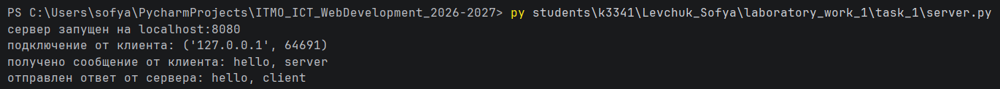

Терминал 2:

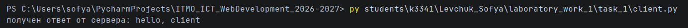

---

## Задание 2. Вычисления через TCP

### Описание

TCP требует установления соединения перед обменом данными и гарантирует доставку и порядок байт. Дополнительные накладные расходы окупаются надёжностью.

**Вариант 2: решение квадратного уравнения** `ax² + bx + c = 0`

**Что происходит:**

- Клиент запрашивает у пользователя коэффициенты `a`, `b`, `c`
- Отправляет их серверу строкой вида `"1, 2, -3"`
- Сервер решает уравнение: считает дискриминант и находит корни
- Возвращает результат клиенту

### Код сервера

??? info "Код"

    ```python
    import socket
    import math
    
    server_socket = socket.socket(socket.AF_INET, socket.SOCK_STREAM)
    
    server_socket.bind(('localhost', 8081))
    
    server_socket.listen(1)
    print("сервер запущен на localhost:8081")
    
    client_connection, client_address = server_socket.accept()
    print(f"подключение от клиента: {client_address}")
    
    request = client_connection.recv(1024).decode()
    print(f"получено сообщение от клиента: {request}")
    
    a, b, c = map(float, request.split(', '))
    
    d = b ** 2 - 4 * a * c
    
    if d > 0:
        x1 = (-b + math.sqrt(d)) / (2 * a)
        x2 = (-b - math.sqrt(d)) / (2 * a)
        response = f"D = {d}, корни: x1 = {x1}, x2 = {x2}"
    elif d == 0:
        x = (-b) / (2 * a)
        response = f"D = {d}, корень: x = {x}"
    else:
        response = f"D = {d}, корней нет"
    
    client_connection.sendall(response.encode())
    
    client_connection.close()
    ```

### Код клиента

??? info "Код"

    ```python
    import socket
    
    client_socket = socket.socket(socket.AF_INET, socket.SOCK_STREAM)
    
    client_socket.connect(('localhost', 8081))
    
    a = input("введите a: ")
    b = input("введите b: ")
    c = input("введите c: ")
    
    message = f"{a}, {b}, {c}"
    client_socket.sendall(message.encode())
    
    response = client_socket.recv(1024).decode()
    print(f"получен ответ от сервера: {response}")
    
    client_socket.close()
    ```

### Запуск

Терминал 1:

```
py students\k3341\Levchuk_Sofya\laboratory_work_1\task_2\server.py
```

Терминал 2:

```
py students\k3341\Levchuk_Sofya\laboratory_work_1\task_2\client.py
```

### Работа

Терминал 1:

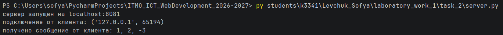

Терминал 2:

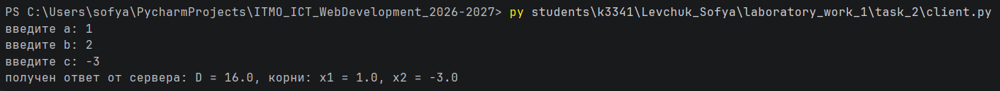

---

## Задание 3. Раздача HTML-страницы по HTTP

### Описание

HTTP — текстовый протокол поверх TCP. Сервер читает файл `index.html` и отправляет его браузеру как HTTP-ответ со строкой статуса, заголовками и телом.

### Код сервера

??? info "Код"

    ```python
    import socket
    
    server_socket = socket.socket(socket.AF_INET, socket.SOCK_STREAM)
    
    server_socket.bind(("localhost", 8080))
    
    server_socket.listen(5)
    print("HTTP-сервер запущен на http://localhost:8080")
    
    client_connection, client_address = server_socket.accept()
    print(f"подключение от клиента: {client_address}")
    
    request = client_connection.recv(1024).decode()
    print(f"получен запрос от клиента: \n{request}")
    
    with open("index.html", "r", encoding="utf-8") as file:
        html_content = file.read()
    
    content_length = len(html_content.encode())
    
    http_response = (
        "HTTP/1.1 200 OK\r\n"
        "Content-Type: text/html; charset=UTF-8\r\n"
        f"Content-Length: {content_length}\r\n"
        "Connection: close\r\n"
        "\r\n"
        + html_content
    )
    
    client_connection.sendall(http_response.encode())
    
    client_connection.close()
    server_socket.close()
    print("работа сервера завершена")
    ```

### HTML-файл

??? info "Код"

    ```html
    <!DOCTYPE html>
    <html lang="ru">
    <head>
        <meta charset="UTF-8">
        <title>Лабораторная работа 1 - задание 3</title>
    </head>
    <body>
        <h1>Эта страница отдана сокетом</h1>
        <p>задание выполнено Левчук Софьей</p>
    </body>
    </html>
    ```

### Запуск

В терминале:

```
cd students/k3341/Levchuk_Sofya/laboratory_work_1/task_3
py server.py
```

Затем открыть в браузере: `http://localhost:8080`

### Работа

Сервер: 
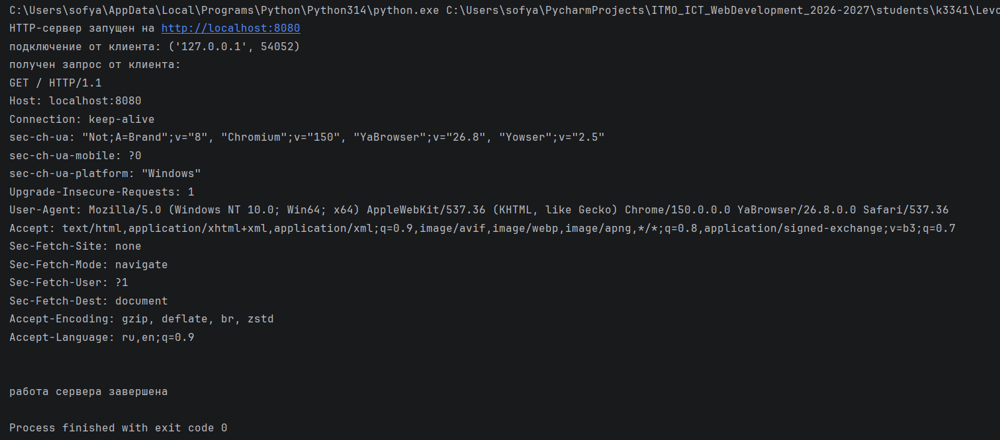

Страница в браузере:

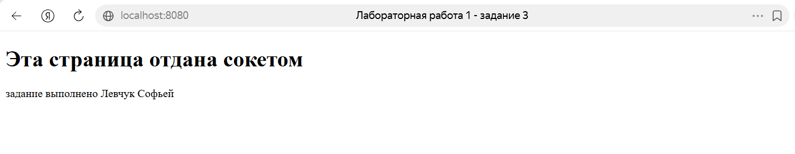

---

## Задание 4. Чат на сокетах (TCP)

### Описание

Сервер обслуживает несколько клиентов одновременно. Для каждого клиента создаётся отдельный поток. Сообщения рассылаются всем участникам, кроме отправителя.

### Код сервера

??? info "Код"

    ```python
    import socket
    import threading
    
    clients = {}
    lock = threading.Lock()
    
    def broadcast(message, sender_socket=None):
        with lock:
            for client_socket in list(clients.keys()):
                if client_socket != sender_socket:
                    try:
                        client_socket.sendall(message.encode())
                    except Exception:
                        client_socket.close()
                        if client_socket in clients:
                            del clients[client_socket]
    
    def handle_client(client_socket, client_address):
        print(f"поток запущен для {client_address}")
        try:
            username = client_socket.recv(1024).decode()
            with lock:
                clients[client_socket] = username
    
            print(f"{client_address} представился как {username}")
            broadcast(f"{username} присоединился к чату", sender_socket = client_socket)
    
            while True:
                data = client_socket.recv(1024)
                if not data:
                    break
                message = data.decode()
    
                if message.strip() == "/exit":
                    break
    
                broadcast(f"[{username}]:{message}", sender_socket = client_socket)
    
        except Exception:
            print(f"ошибка при обработке {client_address}")
    
        finally:
            username = None
            with lock:
                if client_socket in clients:
                    username = clients[client_socket]
                    del clients[client_socket]
            if username:
                broadcast(f"{username} покинул чат")
    
            client_socket.close()
    
    def main():
        server_socket = socket.socket(socket.AF_INET, socket.SOCK_STREAM)
        server_socket.bind(("localhost", 8080))
        server_socket.listen()
        print(f"чат-сервер запущен на localhost:8080")
    
        while True:
            client_socket, client_address = server_socket.accept()
            print(f"новое подключение: {client_address}")
    
            thread = threading.Thread(target=handle_client, args=(client_socket, client_address))
            thread.daemon = True
            thread.start()
    
    if __name__ == "__main__":
        main()
    ```

### Код клиента

??? info "Код"

    ```python
    import socket
    import threading
    
    username = input("введите ваше имя: ")
    
    client_socket = socket.socket(socket.AF_INET, socket.SOCK_STREAM)
    
    client_socket.connect(("localhost", 8080))
    
    client_socket.sendall(username.encode())
    
    def receive_message():
        while True:
            try:
                data = client_socket.recv(1024).decode()
                if not data:
                    break
                print(data)
            except Exception:
                break
    
    receive_thread = threading.Thread(target=receive_message)
    receive_thread.daemon = True
    receive_thread.start()
    print("Вы присоединились к чату. Можете писать сообщения. Для завершения введите /exit")
    
    while True:
        message = input()
        if message.strip() == "/exit":
            client_socket.sendall(b"/exit")
            break
        client_socket.sendall(message.encode())
    
    client_socket.close()
    print("Вы покинули чат")
    ```

### Запуск

Сервер:

```
cd students/k3341/Levchuk_Sofya/laboratory_work_1/task_3
py server.py
```

Терминалы 1, 2, 3 - клиенты:

```
py students\k3341\Levchuk_Sofya\laboratory_work_1\task_3\client.py
```

### Работа

Сервер: 

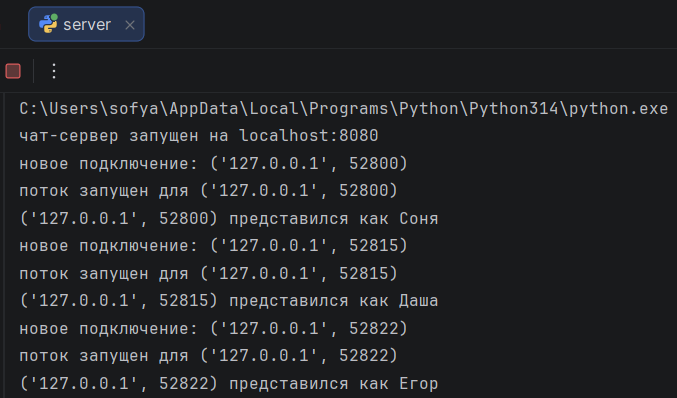

Терминал 1:

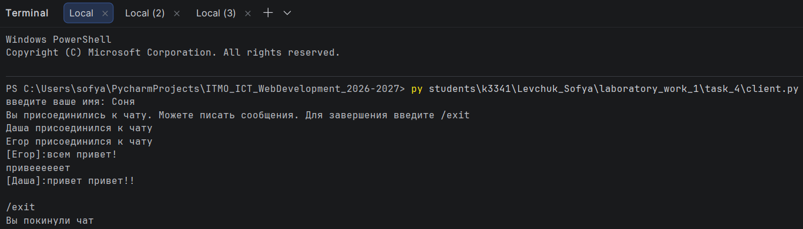

Терминал 2:

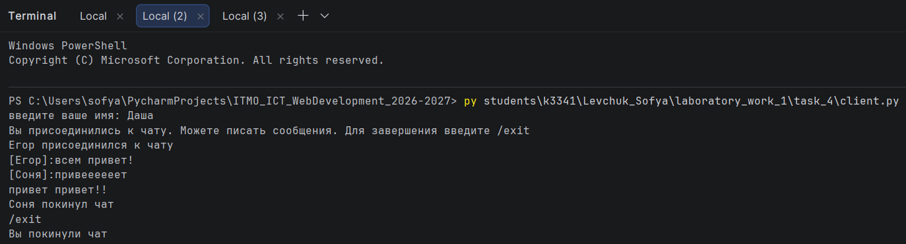

Терминал 3:

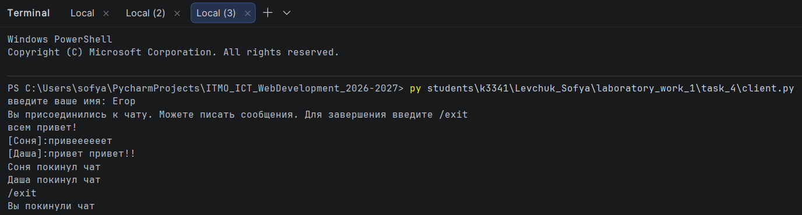

---

## Задание 5. Простой веб-сервер (GET/POST)

### Описание

Сервер принимает GET и POST-запросы, обрабатывает их вручную (без HTTP-библиотек) и хранит журнал оценок, **сгруппированный по дисциплинам**.

### Код сервера

??? info "Код"

    ```python
    import socket
    from urllib.parse import urlparse, parse_qs
    
    
    class MyHTTPServer:
    
        def __init__(self, host, port, name):
            self.host = host
            self.port = port
            self.name = name
            self.grades = {}
    
        def serve_forever(self):
            server_socket = socket.socket(socket.AF_INET, socket.SOCK_STREAM)
            server_socket.bind((self.host, self.port))
            server_socket.listen(5)
            print(f"{self.name} запущен на http://{self.host}:{self.port}", flush=True)
    
            while True:
                client_connection, client_address = server_socket.accept()
                print(f"подключение от {client_address}", flush=True)
    
                try:
                    self.serve_client(client_connection)
                except Exception as e:
                    print(f"ошибка: {type(e).__name__}: {e}", flush=True)
                finally:
                    client_connection.close()
    
        def serve_client(self, connection):
            file = connection.makefile("r", encoding="utf-8")
    
            request_line = file.readline().strip()
            if not request_line:
                return
    
            method, path, params, headers, body = self.parse_request(file, request_line)
            status, response_body = self.handle_request(method, body)
            self.send_response(connection, status, response_body)
    
        def parse_request(self, file, request_line):
            method, url, version = request_line.split()
    
            parsed = urlparse(url)
            path = parsed.path
            params = parse_qs(parsed.query)
    
            headers = self.parse_headers(file)
    
            body = ""
            if "Content-Length" in headers:
                length = int(headers["Content-Length"])
                body = file.read(length)
    
            return method, path, params, headers, body
    
        def parse_headers(self, file):
            headers = {}
    
            while True:
                line = file.readline().strip()
                if not line:
                    break
                key, value = line.split(":", 1)
                headers[key.strip()] = value.strip()
    
            return headers
    
        def handle_request(self, method, body):
            if method == "GET":
                return self.handle_get()
            elif method == "POST":
                return self.handle_post(body)
            else:
                return 405, self.render_error(405, "Method Not Allowed")
    
        def handle_get(self):
            html = self.render_page()
            return 200, html
    
        def handle_post(self, body):
            data = parse_qs(body)
            subject = data.get("subject", [""])[0].strip()
            grade_str = data.get("grade", [""])[0].strip()
    
            if subject and grade_str:
                self.grades.setdefault(subject, []).append(int(grade_str))
                print(f"добавлено: {subject} = {grade_str}", flush=True)
    
            html = self.render_page()
            return 200, html
    
        def render_page(self):
            if not self.grades:
                rows = "<tr><td colspan='2' class='empty'>Оценок нет</td></tr>"
            else:
                rows = ""
                for subject, grades in self.grades.items():
                    grades_str = ", ".join(map(str, grades))
                    rows += f"<tr><td>{subject}</td><td>{grades_str}</td></tr>"
    
            with open("index.html", "r", encoding="utf-8") as file:
                html = file.read()
    
            return html.replace("", rows)
    
        def render_error(self, status, message):
            return f"<html><body><h1>{status} {message}</h1></body></html>"
    
        def send_response(self, connection, status, body):
            body_bytes = body.encode("utf-8")
            reason = {200: "OK", 404: "Not Found", 405: "Method Not Allowed"}.get(status, "OK")
    
            response = (
                f"HTTP/1.1 {status} {reason}\r\n"
                f"Server: {self.name}\r\n"
                "Content-Type: text/html; charset=utf-8\r\n"
                f"Content-Length: {len(body_bytes)}\r\n"
                "Connection: close\r\n"
                "\r\n"
            )
    
            connection.sendall(response.encode("utf-8") + body_bytes)
    
    
    if __name__ == "__main__":
        host = "localhost"
        port = 8082
        name = "MyHTTPServer"
        server = MyHTTPServer(host, port, name)
        try:
            server.serve_forever()
        except KeyboardInterrupt:
            pass
    ```

### HTML-файл

??? info "Код"

    ```html
    <!DOCTYPE html>
    <html lang="ru">
    <head>
        <meta charset="utf-8">
        <title>Журнал оценок</title>
        <style>
            * {
                box-sizing: border-box;
            }
    
            body {
                font-family: Arial, sans-serif;
                background: #f5f5f5;
                color: #333;
                margin: 0;
                padding: 40px 20px;
            }
    
            .container {
                max-width: 720px;
                margin: 0 auto;
                background: #fff;
                padding: 32px;
                border-radius: 8px;
                box-shadow: 0 2px 8px rgba(0, 0, 0, 0.08);
            }
    
            h1 {
                margin-top: 0;
                font-size: 24px;
            }
    
            h2 {
                font-size: 18px;
                margin-top: 28px;
            }
    
            table {
                width: 100%;
                border-collapse: collapse;
                margin-top: 12px;
            }
    
            th, td {
                padding: 10px 12px;
                text-align: left;
                border-bottom: 1px solid #eee;
            }
    
            th {
                background: #fafafa;
                font-size: 14px;
            }
    
            .empty {
                text-align: center;
                color: #aaa;
                padding: 20px;
            }
    
            form {
                display: flex;
                flex-wrap: wrap;
                gap: 8px;
                margin-top: 12px;
            }
    
            input {
                padding: 10px 12px;
                border: 1px solid #ccc;
                border-radius: 4px;
                font-size: 14px;
                font-family: inherit;
                flex: 1 1 140px;
                min-width: 0;
            }
    
            input:focus {
                outline: none;
                border-color: #5b8c5b;
            }
    
            button {
                padding: 10px 20px;
                border: none;
                border-radius: 4px;
                background: #5b8c5b;
                color: #fff;
                font-size: 14px;
                font-family: inherit;
                cursor: pointer;
                flex: 0 0 auto;
            }
    
            button:hover {
                background: #4a7a4a;
            }
    
            @media (max-width: 480px) {
                .container {
                    padding: 20px;
                }
    
                input, button {
                    flex: 1 1 100%;
                }
            }
        </style>
    </head>
    <body>
        <div class="container">
            <h1>Журнал оценок</h1>
    
            <table>
                <thead>
                    <tr><th>Дисциплина</th><th>Оценки</th></tr>
                </thead>
                <tbody>
                    
                </tbody>
            </table>
    
            <h2>Добавить оценку</h2>
            <form method="POST" action="/">
                <input type="text" name="subject" placeholder="Дисциплина" required>
                <input type="number" name="grade" placeholder="Оценка" min="2" max="5" required>
                <button type="submit">Добавить</button>
            </form>
        </div>
    </body>
    </html>
    ```

### Запуск

Из папки задания:

```
cd students/k3341/Levchuk_Sofya/laboratory_work_1/task_5
py server.py
```

Открыть `http://localhost:8082`.

### Работа

**Сервер:**

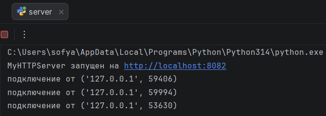

**Пустой журнал:**

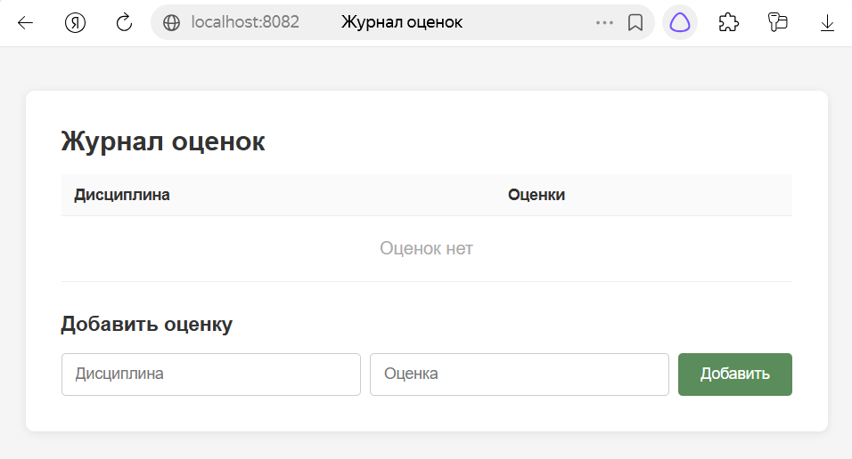

**Несколько дисциплин:**

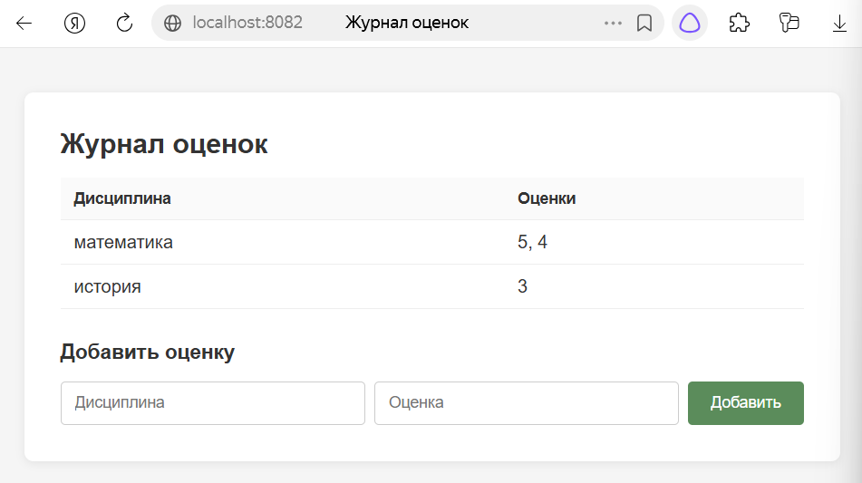

---
