# ЛР2. Простой сайт на Django

**Задание:** Реализовать сайт, используя фреймворк Django, паттерн MVC, технологию шаблонизации Jinja2 и СУБД PostgreSQL, в соответствии с вариантом и техническим заданием. Вариант определяется по порядковому номеру в журнале группы.

**Стек:** Python 3.14, Django 5.2, PostgreSQL, Bootstrap 5

**Вариант 6 - Табло победителей автогонок**

---

## 1. Модель данных

| Модель | Описание | Ключевые поля                                                                                  |
|---|---|------------------------------------------------------------------------------------------------|
| **User** | Участник автогонок (наследник `AbstractUser`) | `username`, `password`, `first_name`, `last_name`, `team`, `experience`, `driver_class`, `bio` |
| **Race** | Автогонка | `name`, `location`, `date`, `description`                                                      |
| **Registration** | Регистрация участника на гонку | `user` (FK), `race` (FK), `car_description`, `race_time`, `result`, `created_at`               |
| **Comment** | Комментарий к гонке | `race` (FK), `author` (FK), `text`, `comment_type`, `rating` (1-10), `created_at`              |

**Связи:**

- `Registration.user → User` (многие-к-одному)
- `Registration.race → Race` (многие-к-одному)
- `Comment.author → User`, `Comment.race → Race`
- `unique_together = ('user', 'race')` - один пользователь не может дважды зарегистрироваться на одну гонку

**Разделение данных:**

- Постоянные данные участника (команда, опыт, класс, биография) - в модели `User`
- Переменные данные участия в конкретной гонке (описание автомобиля, время заезда, результат) - в модели `Registration`

---

## 2. Views

### Публичные

| View | URL | Что делает |
|---|---|---|
| `race_list` | `/` | Список гонок с поиском, фильтром по году, пагинацией |
| `race_detail` | `/races/<pk>/` | Информация о гонке, участники, комментарии |
| `register` | `/register/` | Форма регистрации нового пользователя |
| `user_login` | `/login/` | Форма входа |
| `user_logout` | `/logout/` | Выход из аккаунта |

### Только для авторизованных (`@login_required`)

| View | URL | Что делает |
|---|---|---|
| `registration_create` | `/races/<id>/register/` | Зарегистрировать себя на гонку |
| `my_registrations` | `/my-registrations/` | Список своих регистраций |
| `registration_edit` | `/registrations/<pk>/edit/` | Редактировать **свою** регистрацию |
| `registration_delete` | `/registrations/<pk>/delete/` | Удалить **свою** регистрацию |
| `comment_create` | `/races/<id>/comment/` | Оставить комментарий |

### Только для администраторов (`@user_passes_test(lambda u: u.is_staff)`)

| View | URL | Что делает |
|---|---|---|
| `race_create` | `/races/create/` | Создать гонку |
| `race_edit` | `/races/<pk>/edit/` | Редактировать гонку |
| `race_delete` | `/races/<pk>/delete/` | Удалить гонку |
| `registration_set_result` | `/registrations/<pk>/set-result/` | Установить время и результат заезда |

**Защита админских view:** декоратор `@user_passes_test(lambda u: u.is_staff)`. Если зайдет обычный пользователь - Django редиректит на логин

**Защита пользовательских view:** декоратор `@login_required`

---

## 3. Реализованные интерфейсы

### 3.1. Регистрация и вход

Форма регистрации (`UserCreationForm` с кастомными полями) и форма входа.

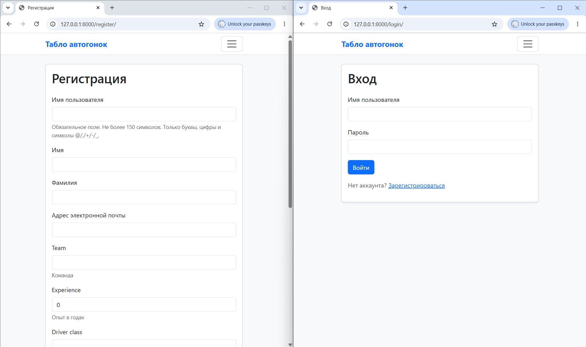

### 3.2. Список гонок - вид администратора

Список всех гонок с таблицей: название, место, дата. Реализована пагинация (5 гонок на страницу), поиск по названию/месту и фильтр по году.

На скрине: **пагинация внизу** и **кнопка «+ Добавить гонку»** - она доступна только администратору.

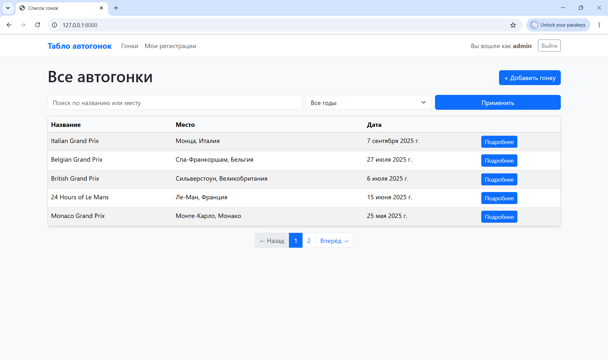

### 3.3. Список гонок - вид обычного пользователя

Тот же список, но под обычным пользователем. **Кнопки «+ Добавить гонку» нет.**

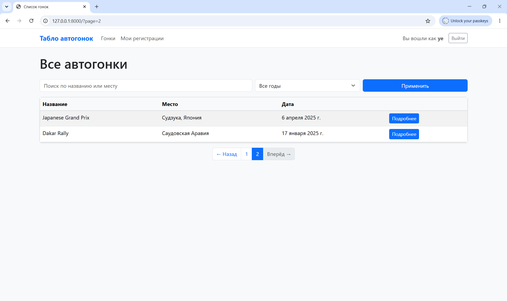

### 3.4. Поиск и фильтрация

Поиск по названию/месту (`Q(name__icontains=...) | Q(location__icontains=...)`) и фильтр по году (`date__year`).

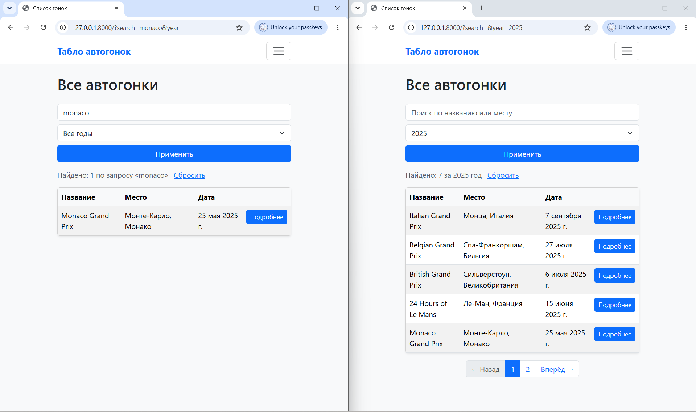

### 3.5. Страница гонки - вид администратора

Информация о гонке, таблица зарегистрированных участников, комментарии.

На скрине:

- **Кнопки «Редактировать гонку» и «Удалить гонку»** - доступны только админу
- В таблице участников - кнопка **«Результат»** с кнопками установки времени и места
- Информация об участнике: ФИО, био, команда, класс, опыт, автомобиль, время, результат

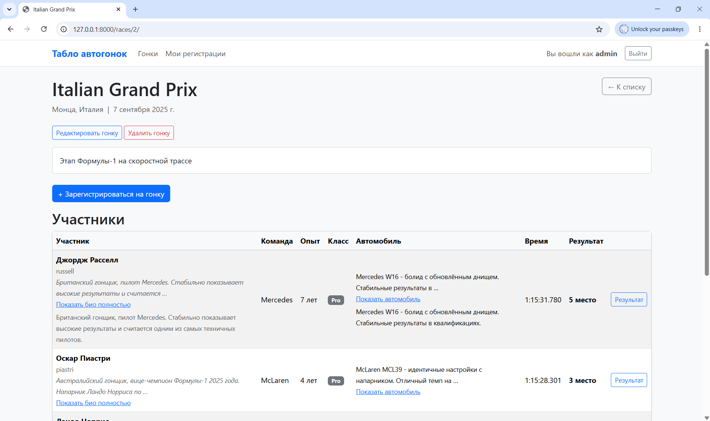

### 3.6. Страница гонки - вид обычного пользователя

Та же гонка под обычным пользователем - **админских кнопок нет**, кнопки «Результат» нет.

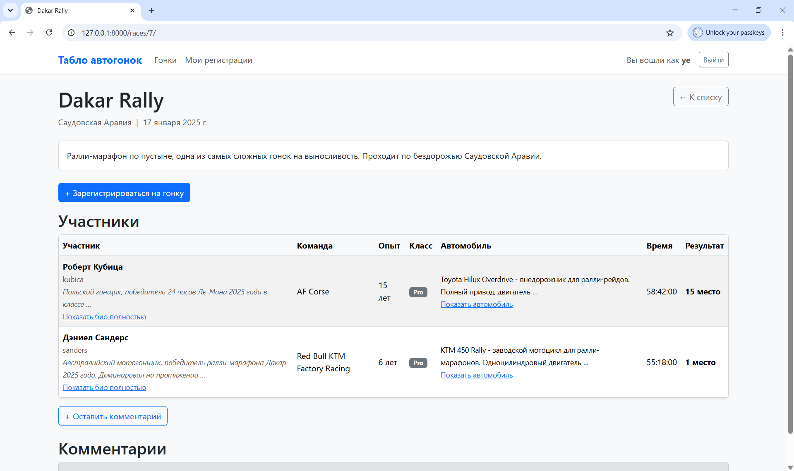

### 3.7. Мои регистрации

Список регистраций текущего пользователя. Из этой страницы можно редактировать и удалять свои регистрации.

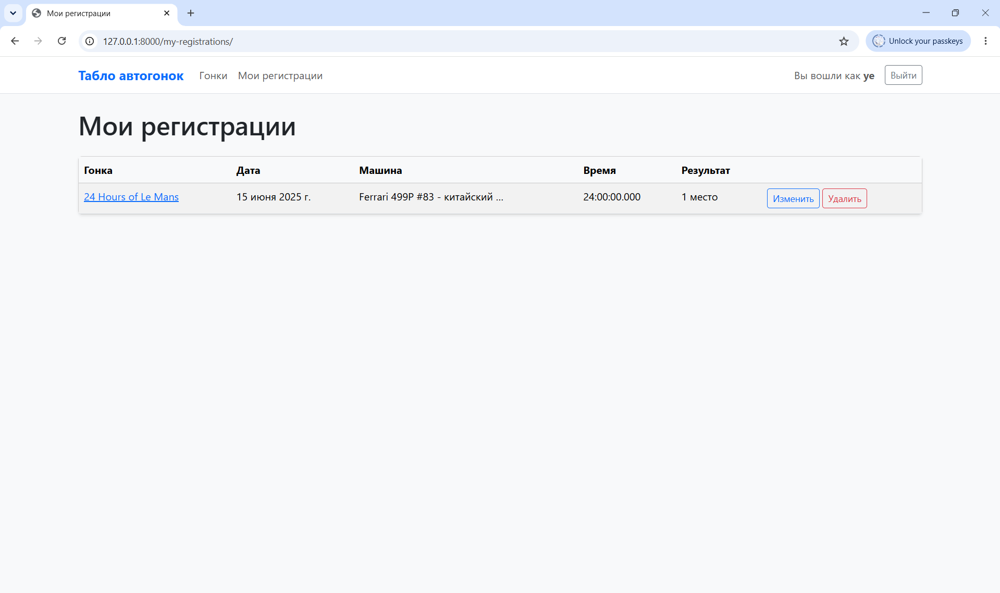

### 3.8. Редактирование и удаление своей регистрации

Формы редактирования и удаления собственной регистрации.

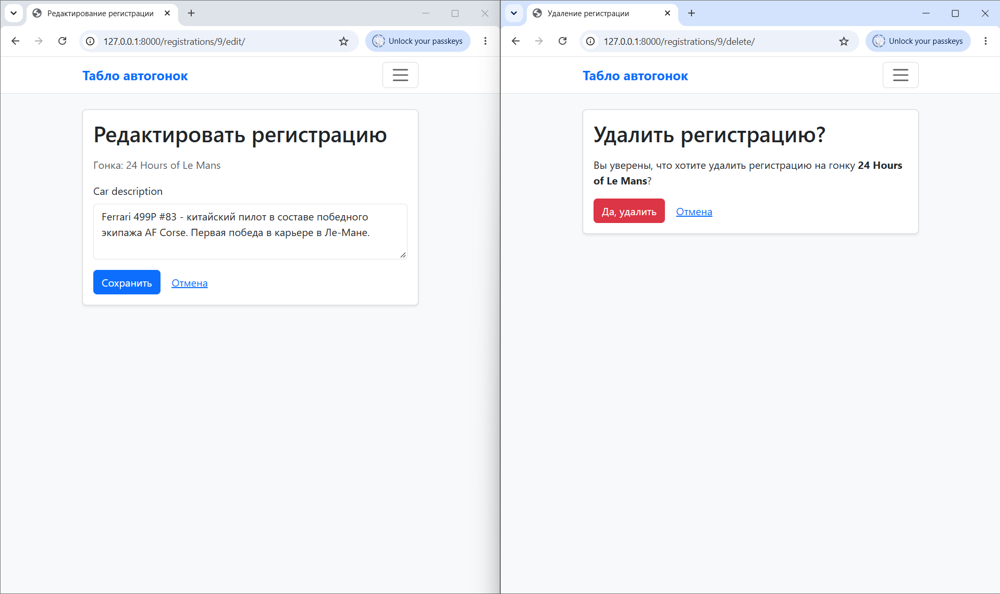

### 3.9. Комментарии

Форма добавления комментария. Поля:

- текст комментария
- тип комментария - выпадающий список с тремя вариантами
- рейтинг (1–10)

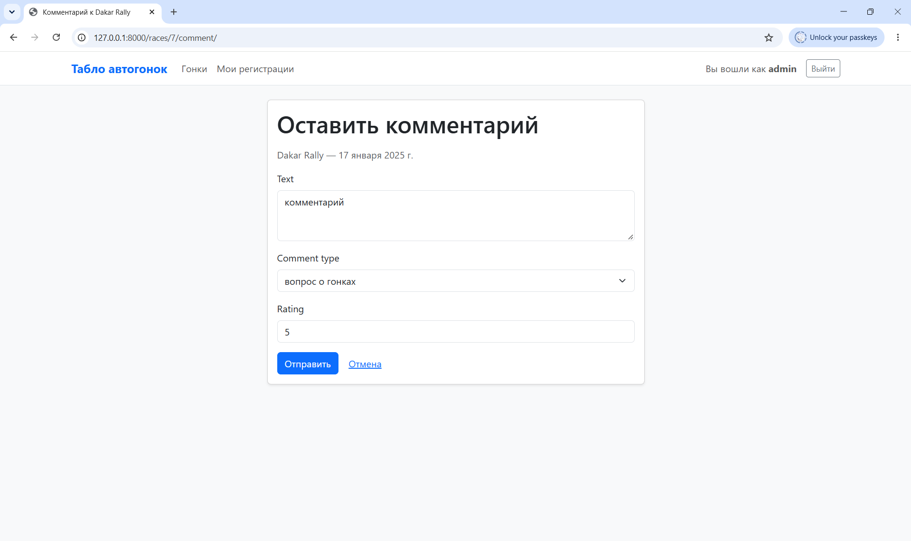

Ниже список добавленных комментариев. Сохраняются: автор, дата создания, текст, тип комментария, рейтинг, а также дата заезда, которая берется из связанной гонки (`comment.race.date`).

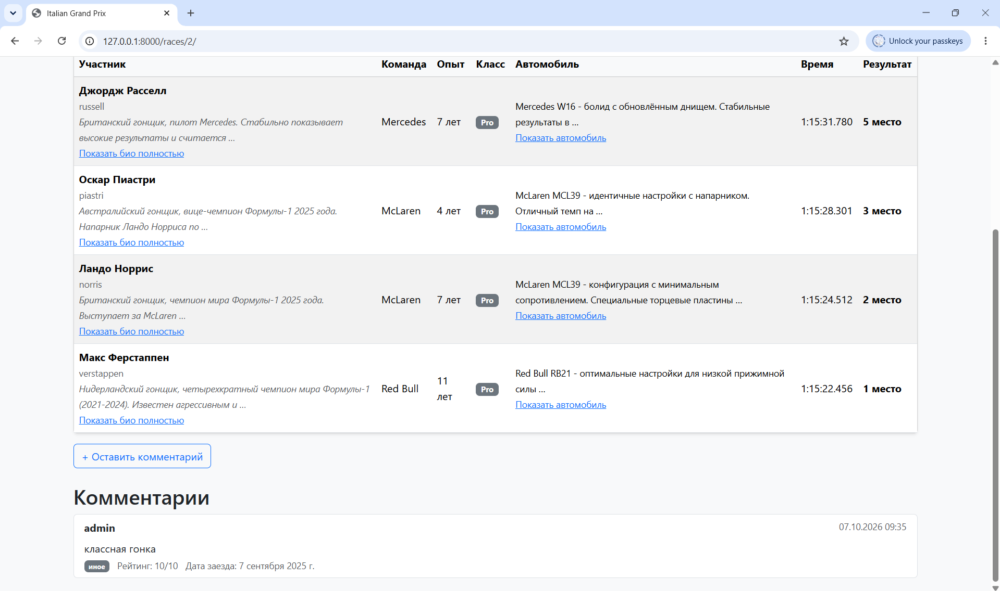

### 3.10. Создание и редактирование гонки (только админ)

CRUD гонок в клиентском интерфейсе, доступен только администратору.

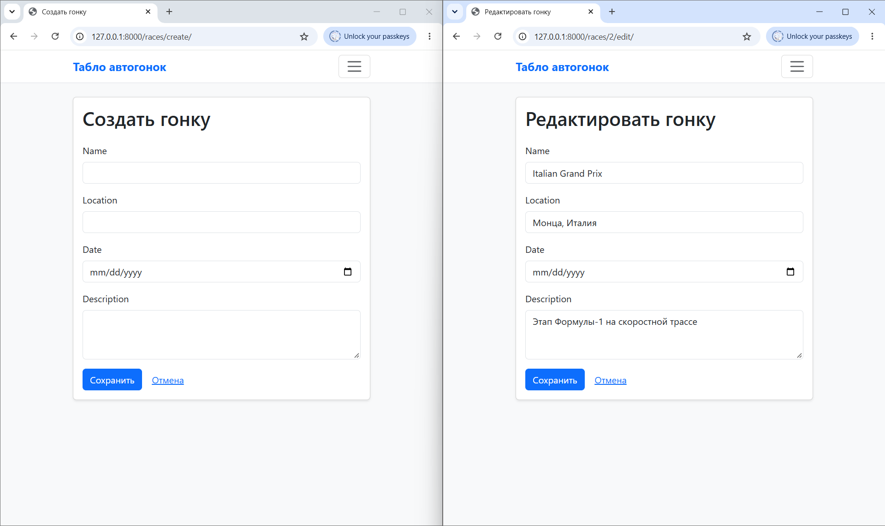

### 3.11. Установка результата (только админ)

Администратор задает время заезда и результат в клиентском интерфейсе.

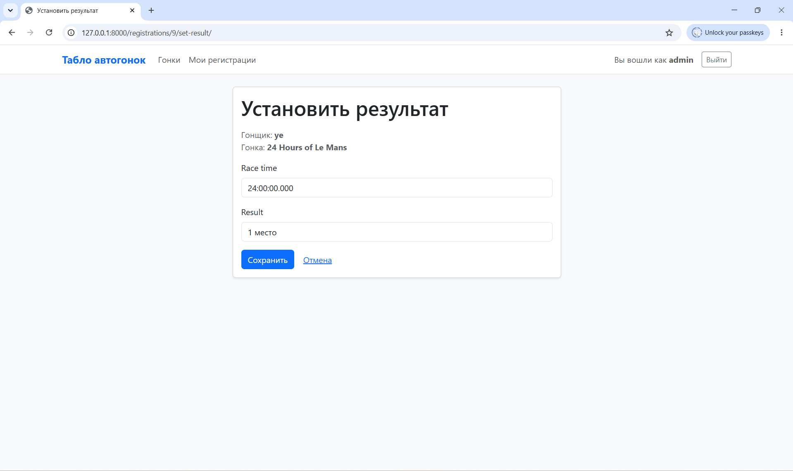

### 3.12. Django-admin

Админка Django.

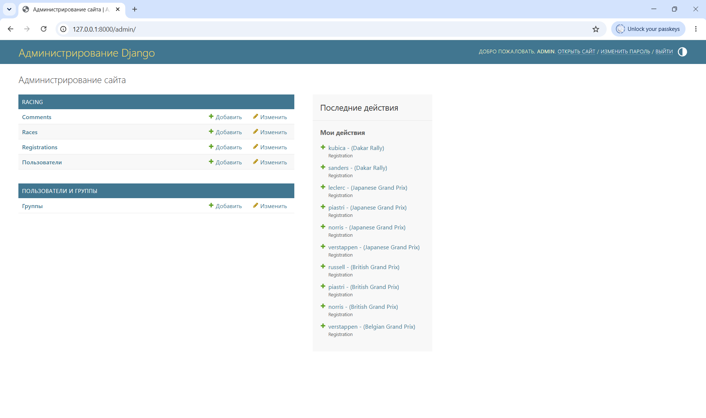

---
